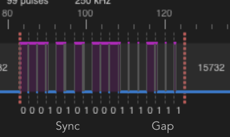
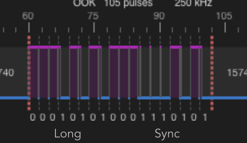

# schanz-rolladen-raspi
Remote Control 433MHz Schanz Rolladen with Raspi

** Status: WIP **

- Experimental SDR on PIN7 using 433.9 MHz transmission (dead code as of 0.0.3)
- Experimental relais controls on pins 16 and 18


# Wiring the USB relais
+ PIN Down: BCM 23 (PIN 18)
+ PIN Up: BCM 24 (PIN 16)


# Installing the MQTT service
+ Prepare a raspi with a fresh raspian
+ `apt-get -y install python3-pip`
+ `git clone https://github.com/8cH9azbsFifZ/schanz-rolladen-raspi.git`
+ `cd schanz-rolladen-raspi/ && pip3 install -r requirements.txt`


# Testing the installation
+ Install mosquitto, i.e. on osx: `brew install mosquitto`
```
mosquitto_pub -h t20 -t rollershutter/control/Test1 -m <Open|Close|Stop|0-100>
mosquitto_pub -h t20 -t rollershutter/control/Test1 -m Open
mosquitto_pub -h t20 -t rollershutter/control/Test1 -m Close
mosquitto_pub -h t20 -t rollershutter/control/Test1 -m Stop
mosquitto_pub -h t20 -t rollershutter/control/Test1 -m 30
mosquitto_sub -h t20 -t rollershutter/Test1/percentage
```


# How to reverse engineer the signals

+ Frequency Range of the remote control is at about 433.950 MHz (Found out pressing one button while tuning with my Yaesu FT 817)
+ Connect a RTL SDR to a raspi


## Prepare the raspi
+ Installation script: `./install.sh`

## Store the button signals
+ Start copying the button signals using `./rtlmenu.sh`: Record, set frequency (433.950 in my case), set gain to 0 (AGC), record.
+ Play back using `sudo ./sendiq -s 250000 -f 433.9500e6 -t u8 -i record.iq` (without wire antenna on GPIO7, so that the range is only in centimeters)
+ I checked the output using my Yaesu FT 817
+ One working save the record.iq file to buttonX.iq and continue with the next button.
+ You may shorten the signals afterwars using simply `dd if=button_close.iq of=button_close_short.iq bs=8 count=20000`

## Analyze using rtl_433
+ Install the tool: `brew install rtl_433`

### Close Button
+ `rtl_433 -A -r 250k:433.95M:cu8:button_close.iq`

Yields: Use a flex decoder with -X 'n=name,m=OOK_PWM,s=348,l=2076,r=15740,g=1984,t=691,y=0'

  [04] {18} 15 1d c0  : 00010101 00011101 11



### Open Button
+ `rtl_433 -A -r 250k:433.95M:cu8:button_open.iq`

Yields: Use a flex decoder with -X 'n=name,m=OOK_PWM,s=332,l=2064,r=15748,g=2004,t=693,y=0'

  [04] {18} 15 1d 40  : 00010101 00011101 01




# Testing with minicul
- https://github.com/RFD-FHEM/SIGNALDuino/releases
sudo avrdude -c arduino -b57600 -P /dev/ttyUSB0 -p atmega328p -vv -U SIGNALDuino_miniculcc1101_3.5.0.hex
picocom /dev/ttyUSB0 -b 57600
- https://github.com/RFD-FHEM/SIGNALDuino/wiki/Commands


# References
- https://hagensieker.com/2019/01/12/rpitx-replay-attack-on-ge-myselectsmart-remote-control-outlet/
- RTL SDR IQ Format: *.cu8 - Complex 8-bit unsigned integer samples (RTL-SDR) https://k3xec.com/packrat-processing-iq/
- Formats https://github.com/glv2/convert-samples
- RTL 433 Tool https://github.com/merbanan/rtl_433
- The motor is a Siral EL4F motor with 433 MHz remote control
- Using a realais: https://blog.berrybase.de/blog/2020/08/12/relais-steuerung-mit-dem-raspberry-pi-so-funktionierts/
