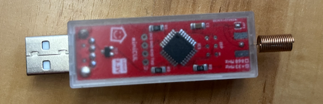

# schanz-rolladen-raspi
Remote Control 433MHz Schanz Rolladen with Raspi.

Using a minicul and the SIGNALduino FHEM module create an interface for a rollershutter using MQTT. 
FHEM is encapsulated in a separate container only for the purpose of sending the 433,95 MHz commands
to the rollershutter motor. A separate container provides a python script for sending the commands to fhem
and serving an interface using MQTT.

The following topics will be used:

| Description   | Topic                                | Values         |
| ------------- | ------------------------------------ | -------------- |
| Set position  | rollershutter/control_position/Test1 | 0-100          |
| Control       | rollershutter/control/Test1          | Open, Close, Stop |
| State         | rollershutter/Test1/state            | open, closed, opening, closing, stopped |
| Position      | rollershutter/Test1/percentage       | 0-100 |

+ 0% == Open, 100% == Closed

Thus this module is compatible with HomeAssistant and OpenHab.



# Installation

## Configuring the varibles for the containers
Configure the following variables in the [docker-compose.yml](doc/example_configurations/docker-compose.yml) file: 
`MQTT_HOST MQTT_PORT FHEM_HOST FHEM_PORT TIME_OPEN TIME_CLOSE ROLLERSHUTTER_NAME`.
(If the variable `SIMULATION` is defined, run in simulation mode.)

### Testing the installation
+ Install mosquitto, i.e. on osx: `brew install mosquitto` 
+ Optionally use the dashboard using docker-compose described [here](doc/mqtt/docker-compose.yml)
+ Set position topic: 0-100 `mosquitto_pub -h t20 -t rollershutter/control_position/Test1 -m 30`
+ Set control topic: Open, Close, Stop
```
mosquitto_pub -h t20 -t rollershutter/control/Test1 -m Open
mosquitto_pub -h t20 -t rollershutter/control/Test1 -m Close
mosquitto_pub -h t20 -t rollershutter/control/Test1 -m Stop
```
+ State topic: open, closed, opening, closing, stopped - `mosquitto_sub -h t20 -t rollershutter/Test1/state`
+ Position topic: 0-100 - `mosquitto_sub -h t20 -t rollershutter/Test1/percentage`

## Configuration for HomeAssistant
+ Install the MQTT integration and provide your server
+ Copy and adjust the configuration in [HA Config](doc/example_configurations/homeassistant-config.yaml) to your setup

## Configuration for OpenHAB
+ Install the mqtt binding
+ Copy and adjust the things configuration [Things](doc/example_configurations/openhab.things)
+ Copy and adjust the item configuration [Item](doc/example_configurations/openhab.items)


# References
- The motor is a Siral EL4F motor with 433 MHz remote control: https://www.siral.de/index.php?id=127
- MQTT interface: https://www.home-assistant.io/integrations/cover.mqtt/
- Using SIGNALduino https://wiki.fhem.de/wiki/SIGNALduino
- And FHEM https://wiki.fhem.de/wiki/Hauptseite
- OpenHAB MQTT integration https://www.openhab.org/addons/bindings/mqtt.generic/
- Experiments and scrapbook for reverse engineering this protocol [Scrapbook](doc/experiments/README.md)
