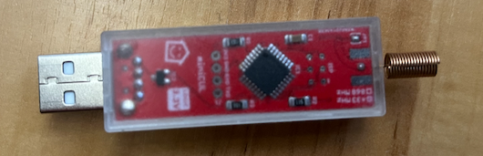

# schanz-rolladen-raspi
Remote Control 433MHz Schanz Rolladen with Raspi.

Using a minicul and the SIGNALduino FHEM module create an interface for a rollershutter using MQTT.
FHEM is encapsulated in a separate container only for the purpose of sending the 433.95 MHz commands
to the rollershutter motor (Siral EL4F). A separate container provides a Python script for sending the commands to FHEM
and serving an interface using MQTT.

An alternative relais-based GPIO mode exists for direct button emulation without FHEM (see [relais docker-compose](doc/example_configurations/relais/docker-compose.yml)).

## MQTT Topics

The following topics will be used (replace `Test1` with your `ROLLERSHUTTER_NAME`):

| Description   | Topic                                | Values         |
| ------------- | ------------------------------------ | -------------- |
| Set position  | rollershutter/control_position/Test1 | 0-100          |
| Control       | rollershutter/control/Test1          | Open, Close, Stop |
| State         | rollershutter/Test1/state            | open, closed, opening, closing, stopped |
| Position      | rollershutter/Test1/percentage       | 0-100 |

+ 0% == Open, 100% == Closed

Thus this module is compatible with Home Assistant and OpenHAB.



# Installation

## Configuring the variables for the containers
Configure the following environment variables in the [docker-compose.yml](doc/example_configurations/docker-compose.yml) file:

| Variable | Default | Description |
|----------|---------|-------------|
| `MQTT_HOST` | `t20` | MQTT broker hostname |
| `MQTT_PORT` | `1883` | MQTT broker port |
| `FHEM_HOST` | `minicul-raspi` | FHEM server hostname |
| `FHEM_PORT` | `8083` | FHEM HTTP port |
| `TIME_OPEN` | `53` | Seconds for full open travel |
| `TIME_CLOSE` | `53` | Seconds for full close travel |
| `ROLLERSHUTTER_NAME` | `Test1` | Name used in MQTT topics |
| `PIN_BCM_UP` | `23` | GPIO BCM pin for open (relais mode) |
| `PIN_BCM_DOWN` | `24` | GPIO BCM pin for close (relais mode) |
| `SIMULATION` | unset | Set to enable simulation mode |

The Docker setup consists of two containers: the rollershutter MQTT service and a FHEM container with access to the minicul USB transceiver at `/dev/ttyUSB0`. A Docker health check verifies the FHEM/SIGNALduino connection.

## Testing the installation
+ Install mosquitto, e.g. on macOS: `brew install mosquitto`
+ Optionally use the dashboard using docker-compose described [here](doc/mqtt/docker-compose.yml)
+ Set position topic: 0-100 `mosquitto_pub -h <host> -t rollershutter/control_position/Test1 -m 30`
+ Set control topic: Open, Close, Stop
```
mosquitto_pub -h <host> -t rollershutter/control/Test1 -m Open
mosquitto_pub -h <host> -t rollershutter/control/Test1 -m Close
mosquitto_pub -h <host> -t rollershutter/control/Test1 -m Stop
```
+ State topic: open, closed, opening, closing, stopped - `mosquitto_sub -h <host> -t rollershutter/Test1/state`
+ Position topic: 0-100 - `mosquitto_sub -h <host> -t rollershutter/Test1/percentage`

## Configuration for Home Assistant
+ Install the MQTT integration and provide your server
+ Copy and adjust the configuration in [HA Config](doc/example_configurations/homeassistant-config.yaml) to your setup

## Native Home Assistant integration (HACS, experimental, without FHEM)
This repository now contains a native custom integration at `custom_components/schanz_rolladen`.

### What it does
+ Exposes a native `cover` entity in Home Assistant.
+ Sends Open/Close commands directly to the Minicul USB stick over serial.
+ Uses time-based position estimation (0=open, 100=closed), including `set position`.

### Install with HACS (manual custom repository)
1. Add this repository as a custom HACS repository (`Integration` type).
2. Install **Schanz Rolladen** from HACS.
3. Restart Home Assistant.
4. Add integration via **Settings -> Devices & Services -> Add Integration**.

### Required setup on Home Assistant Green
+ Plug in the Minicul USB stick.
+ Use a stable serial path if available (recommended): `/dev/serial/by-id/...`
+ Device detection is now automatic by default (`auto_detect_device = true`), with preference for CH340/1A86 by-id paths.
+ Typical defaults are:
  - Baudrate: `57600`
  - Open command: `P46#111010101110001010#R10`
  - Close command: `P46#111010101110001000#R10`
  - Transport prefix: `sendMsg `
  - Transport suffix: newline (`\n`)

### Migration from MQTT/FHEM
1. Keep your existing MQTT/FHEM setup running while you add the native integration.
2. Add the native `Schanz Rolladen` entity and verify Open/Close/Stop.
3. Update automations/dashboard cards to target the native cover entity.
4. Remove MQTT cover config and stop the FHEM bridge container after successful migration.

### Troubleshooting
+ Serial device not found: re-check path in integration options, prefer `/dev/serial/by-id/...`.
+ Commands not working: verify command prefix/suffix and protocol strings in options.
+ Position mismatch: calibrate `time_open` and `time_close` values for your shutter.

## Configuration for OpenHAB
+ Install the MQTT binding
+ Copy and adjust the things configuration [Things](doc/example_configurations/openhab.things)
+ Copy and adjust the item configuration [Item](doc/example_configurations/openhab.items)


# References
- The motor is a Siral EL4F motor with 433 MHz remote control: https://www.siral.de/index.php?id=127
- MQTT interface: https://www.home-assistant.io/integrations/cover.mqtt/
- Using SIGNALduino: https://wiki.fhem.de/wiki/SIGNALduino
- FHEM: https://wiki.fhem.de/wiki/Hauptseite
- OpenHAB MQTT integration: https://www.openhab.org/addons/bindings/mqtt.generic/
- Experiments and scrapbook for reverse engineering this protocol: [Scrapbook](doc/experiments/README.md)
