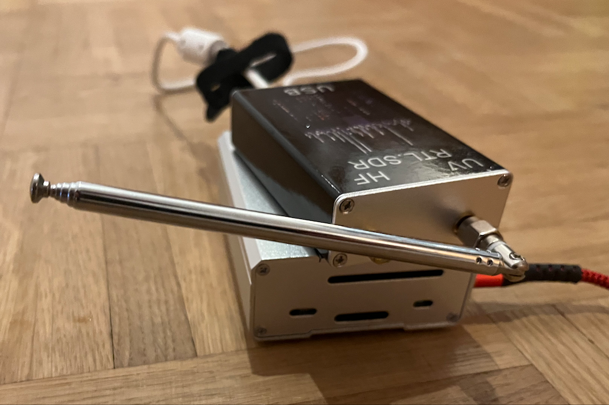
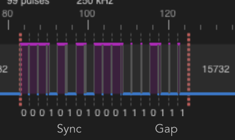
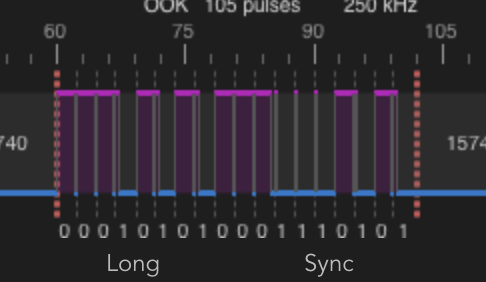

# Experimental with Raspi 

** Scrapbook **

- Experimental relais controls on pins 16 and 18
- Experimental SDR on PIN7 using 433.9 MHz transmission (dead code as of 0.0.4)
- Reverse engineering using fhem, minicul and signalduino


# Testing with minicul
- https://github.com/RFD-FHEM/SIGNALDuino/releases
sudo avrdude -c arduino -b57600 -P /dev/ttyUSB0 -p atmega328p -vv -U SIGNALDuino_miniculcc1101_3.5.0.hex
picocom /dev/ttyUSB0 -b 57600
- https://github.com/RFD-FHEM/SIGNALDuino/wiki/Commands


### With FHEM


cf. Tedsen_SKX2xx


deviceCode = 1FFF1F0
protocol 46


### Open
set sigduino sendMsg P46#111010101110001010#R10
docker-compose exec fhem perl /opt/fhem/fhem.pl 7072 "set sigduino sendMsg P46#111010101110001010#R10"
data open EAE28

fhem_1  | 2023.08.11 14:38:17.444 1: sigduino: SD_UT_Parse UNDEFINED sensor unknown detected, protocol 46, data EAE28, code 1FFF1F0
000101010001110101

fhem_1  | 2023.08.11 15:39:35.749 1: sigduino: SD_UT_Parse UNDEFINED sensor unknown detected, protocol 46, data EAE28, code 1FFF1F0 and GEROLF 1FFF1F0FF

FF => 1010 

### Close
set sigduino sendMsg P46#111010101110001000#R10
docker-compose exec fhem perl /opt/fhem/fhem.pl 7072 "set sigduino sendMsg P46#111010101110001000#R10"
data close EAE20

fhem_1  | 2023.08.11 14:38:10.427 1: sigduino: SD_UT_Parse UNDEFINED sensor unknown detected, protocol 46, data EAE20, code 1FFF1F0
000101010001110111
fhem_1  | 2023.08.11 15:40:00.439 1: sigduino: SD_UT_Parse UNDEFINED sensor unknown detected, protocol 46, data EAE20, code 1FFF1F0 and GEROLF 1FFF1F0F0
=> TRISTATE CODE
F0 =>  1000


fhem_1  | 2023.08.11 16:09:48.838 4: sigduino: SD_UT protocol 46, bitData 11101010111000101000, hlen 5

### Refs

https://hub.docker.com/r/fhem/fhem

https://github.com/fhem/fhem-docker/blob/dev/docker-compose.yml
https://www.fhemwiki.de/wiki/SIGNALduino
https://www.fhemwiki.de/wiki/Unbekannte_Funkprotokolle#Ansatz_1_-_Versuchen
https://github.com/RFD-FHEM/SIGNALDuino/issues/293
/dev/ttyUSB0@57600

/dev/serial/by-id/usb-1a86_USB_Serial-if00-port0


# Wiring the USB relais
+ PIN Down: BCM 23 (PIN 18)
+ PIN Up: BCM 24 (PIN 16)


# How to reverse engineer the signals using SDR approach

+ Frequency Range of the remote control is at about 433.950 MHz (Found out pressing one button while tuning with my Yaesu FT 817)
+ Connect a RTL SDR to a raspi


## Prepare the raspi
+ Installation script: 

```

git clone https://github.com/F5OEO/rpitx
cd rpitx
./install.sh

sudo chmod +s /usr/bin/sendiq

```

## Store the button signals
+ Start copying the button signals using `./rtlmenu.sh`: Record, set frequency (433.950 in my case), set gain to 0 (AGC), record.
+ Play back using `sudo ./sendiq -s 250000 -f 433.9500e6 -t u8 -i record.iq` (without wire antenna on GPIO7, so that the range is only in centimeters)
+ I checked the output using my Yaesu FT 817
+ One working save the record.iq file to buttonX.iq and continue with the next button.
+ You may shorten the signals afterwars using simply `dd if=button_close.iq of=button_close_short.iq bs=8 count=20000`

## Analyze using rtl_433
+ Install the tool: `brew install rtl_433`

### Close Button
+ `rtl_433 -A -r 250k:433.95M:cu8:button_close.iq`

Yields: Use a flex decoder with -X 'n=name,m=OOK_PWM,s=348,l=2076,r=15740,g=1984,t=691,y=0'

  [04] {18} 15 1d c0  : 00010101 00011101 11



### Open Button
+ `rtl_433 -A -r 250k:433.95M:cu8:button_open.iq`

Yields: Use a flex decoder with -X 'n=name,m=OOK_PWM,s=332,l=2064,r=15748,g=2004,t=693,y=0'

  [04] {18} 15 1d 40  : 00010101 00011101 01




# References
- https://hagensieker.com/2019/01/12/rpitx-replay-attack-on-ge-myselectsmart-remote-control-outlet/
- RTL SDR IQ Format: *.cu8 - Complex 8-bit unsigned integer samples (RTL-SDR) https://k3xec.com/packrat-processing-iq/
- Formats https://github.com/glv2/convert-samples
- RTL 433 Tool https://github.com/merbanan/rtl_433
- Using a realais: https://blog.berrybase.de/blog/2020/08/12/relais-steuerung-mit-dem-raspberry-pi-so-funktionierts/
