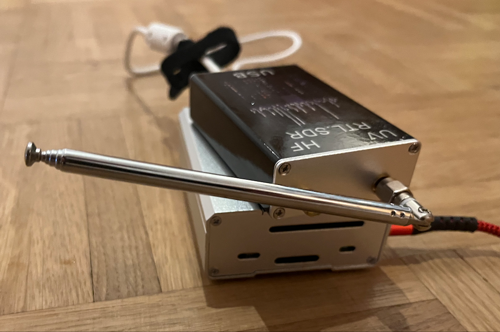
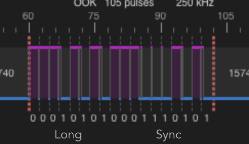

# Experimental with Raspi 

** Scrapbook **

- Experimental relais controls on pins 16 and 18
- Experimental SDR on PIN7 using 433.9 MHz transmission (dead code as of 0.0.4)

# Wiring the USB relais
+ PIN Down: BCM 23 (PIN 18)
+ PIN Up: BCM 24 (PIN 16)


# How to reverse engineer the signals

+ Frequency Range of the remote control is at about 433.950 MHz (Found out pressing one button while tuning with my Yaesu FT 817)
+ Connect a RTL SDR to a raspi


## Prepare the raspi
+ Installation script: 

```

git clone https://github.com/F5OEO/rpitx
cd rpitx
./install.sh

sudo chmod +s /usr/bin/sendiq

```

## Store the button signals
+ Start copying the button signals using `./rtlmenu.sh`: Record, set frequency (433.950 in my case), set gain to 0 (AGC), record.
+ Play back using `sudo ./sendiq -s 250000 -f 433.9500e6 -t u8 -i record.iq` (without wire antenna on GPIO7, so that the range is only in centimeters)
+ I checked the output using my Yaesu FT 817
+ One working save the record.iq file to buttonX.iq and continue with the next button.
+ You may shorten the signals afterwars using simply `dd if=button_close.iq of=button_close_short.iq bs=8 count=20000`

## Analyze using rtl_433
+ Install the tool: `brew install rtl_433`

### Close Button
+ `rtl_433 -A -r 250k:433.95M:cu8:button_close.iq`

Yields: Use a flex decoder with -X 'n=name,m=OOK_PWM,s=348,l=2076,r=15740,g=1984,t=691,y=0'

  [04] {18} 15 1d c0  : 00010101 00011101 11


### Open Button
+ `rtl_433 -A -r 250k:433.95M:cu8:button_open.iq`

Yields: Use a flex decoder with -X 'n=name,m=OOK_PWM,s=332,l=2064,r=15748,g=2004,t=693,y=0'

  [04] {18} 15 1d 40  : 00010101 00011101 01




# Testing with minicul
- https://github.com/RFD-FHEM/SIGNALDuino/releases
sudo avrdude -c arduino -b57600 -P /dev/ttyUSB0 -p atmega328p -vv -U SIGNALDuino_miniculcc1101_3.5.0.hex
picocom /dev/ttyUSB0 -b 57600
- https://github.com/RFD-FHEM/SIGNALDuino/wiki/Commands


### With FHEM
- Closing :

fhem_1  | 2023.08.11 14:38:10.427 1: sigduino: SD_UT_Parse UNDEFINED sensor unknown detected, protocol 46, data EAE20, code 1FFF1F0
000101010001110111
fhem_1  | 2023.08.11 15:40:00.439 1: sigduino: SD_UT_Parse UNDEFINED sensor unknown detected, protocol 46, data EAE20, code 1FFF1F0 and GEROLF 1FFF1F0F0
=> TRISTATE CODE
F0 =>  1000


fhem_1  | 2023.08.11 16:09:48.838 4: sigduino: SD_UT protocol 46, bitData 11101010111000101000, hlen 5


- Opening
fhem_1  | 2023.08.11 14:38:17.444 1: sigduino: SD_UT_Parse UNDEFINED sensor unknown detected, protocol 46, data EAE28, code 1FFF1F0
000101010001110101

fhem_1  | 2023.08.11 15:39:35.749 1: sigduino: SD_UT_Parse UNDEFINED sensor unknown detected, protocol 46, data EAE28, code 1FFF1F0 and GEROLF 1FFF1F0FF

FF => 1010 


Tedsen_SKX2xx

entspricht genau dem!


      $deviceCode = SD_UT_bin2tristate(substr($bitData,0,14));    # only 14 bit from bitdata to tristate
      $devicedef = 'Tedsen_SKX1xx ' . $deviceCode if (!$def);
      $def = $modules{SD_UT}{defptr}{$devicedef} if (!$def);
      $devicedef = 'Tedsen_SKX2xx ' . $deviceCode if (!$def);


            $def = $modules{SD_UT}{defptr}{$devicedef} if (!$def);

  my %tristatetobin=(
     '0' => '00',
     'F' => '10',
     '1' => '11'
  );


    Log3 $iohash, 1, "$ioname: SD_UT_Parse UNDEFINED sensor $model detected, protocol $protocol, data $rawData, code $deviceCode";


deviceCode = 1FFF1F0
protocol 46
data open EAE28
data close EAE20


RAWMSG
MU;P0=10688;P1=-9176;P2=2057;P3=-243;P4=345;P5=-1968;P6=-15643;D=01232323452345234523232345454523452346232323452345234523232345454523452346232323452345234523232345454523452346232323452345234523232345454523452346232323452345234523232345454523452346232323452345234523232345454523452346232323452345234523232345454523452346;CP=4;R=28;O;

MU;P0=2023;P1=-265;P2=336;P3=-1969;P5=-15645;D=01012301230123010101232323012301250101012301230123010101232323012301250101012301230123010101232323012301250101012301230123010101232323012301250101012301230123010101232323012301250101012301230123010101232323012301250101012301230123010101232323012301250101;CP=2;R=40;O;


set sigduino sendMsg P46#00111010#R4


MU;P0=2023;P1=-265;P2=336;P3=-1969;P5=-15645;D=01012301230123010101232323012301250101012301230123010101232323012301250101012301230123010101232323012301250101012301230123010101232323012301250101012301230123010101232323012301250101012301230123010101232323012301250101012301230123010101232323012301250101;CP=2;R=40;O;


set sigduino raw SR;;R=40;;P0=2023;;P1=-265;;P2=336;;P3=-1969;;P5=-15645;;D=01012301230123010101232323012301250101012301230123010101232323012301250101012301230123010101232323012301250101012301230123010101232323012301250101012301230123010101232323012301250101012301230123010101232323012301250101012301230123010101232323012301250101;;CP=2;;


set sigduino raw SR;;R=3;;P0=4742;;P1=-1554;;P2=286;;P3=-786;;P4=649;;P5=-420;;D=0123234545234545452323232323454523234523454523232345454523232323452345234523452345;;


set sigduino sendMsg P3#00111010#R4


MU;P0=9296;P1=-9184;P2=2067;P3=-232;P4=345;P5=-1968;P6=-15645;D=01232323452345234523232345454523452346232323452345234523232345454523452346232323452345234523232345454523452346232323452345234523232345454523452346232323452345234523232345454523452346232323452345234523232345454523452346232323452345234523232345454523452346;CP=4;R=31;O;

set sigduino raw SR;;P0=9296;;P1=-9184;;P2=2067;;P3=-232;;P4=345;;P5=-1968;;P6=-15645;;D=01232323452345234523232345454523452346232323452345234523232345454523452346232323452345234523232345454523452346232323452345234523232345454523452346232323452345234523232345454523452346232323452345234523232345454523452346232323452345234523232345454523452346;;CP=4;;R=10;;O;;


CMD=$@
HOST=raspimatic-raspi-wlan
PORT=8083
TOKEN=`curl -s -D - "http://$HOST:$PORT/fhem&XHR=1" | awk '/X-FHEM-csrfToken/{print $2}'`
URL="http://$HOST:$PORT/fhem?XHR=1&fwcsrf=$TOKEN"
URL=${URL%$'\r'}
DATA="cmd=$CMD"

curl -s -G "$URL" --data-urlencode "$DATA"


# Open
set sigduino sendMsg P46#111010101110001010#R10
docker-compose exec fhem perl /opt/fhem/fhem.pl 7072 "set sigduino sendMsg P46#111010101110001010#R10"


# Close
set sigduino sendMsg P46#111010101110001000#R10
docker-compose exec fhem perl /opt/fhem/fhem.pl 7072 "set sigduino sendMsg P46#111010101110001000#R10"


https://hub.docker.com/r/fhem/fhem

https://github.com/fhem/fhem-docker/blob/dev/docker-compose.yml
https://www.fhemwiki.de/wiki/SIGNALduino
https://www.fhemwiki.de/wiki/Unbekannte_Funkprotokolle#Ansatz_1_-_Versuchen
https://github.com/RFD-FHEM/SIGNALDuino/issues/293
/dev/ttyUSB0@57600

/dev/serial/by-id/usb-1a86_USB_Serial-if00-port0


# References
- https://hagensieker.com/2019/01/12/rpitx-replay-attack-on-ge-myselectsmart-remote-control-outlet/
- RTL SDR IQ Format: *.cu8 - Complex 8-bit unsigned integer samples (RTL-SDR) https://k3xec.com/packrat-processing-iq/
- Formats https://github.com/glv2/convert-samples
- RTL 433 Tool https://github.com/merbanan/rtl_433